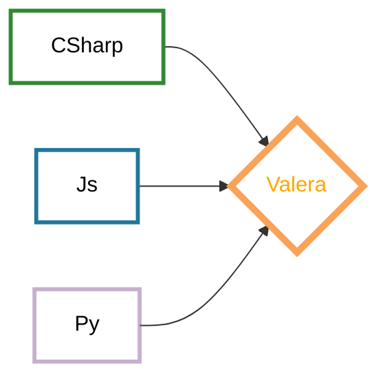

  

<a href="потом добавлю, ъ">

  

</a>

---
**I am a C# Developer** .
-I’m looking for help **with C#** and **you can ask me** something about C#.
  
⚡Fun fact: Опытный разработчик всегда посмотрит направо и налево, даже если переходит улицу с односторонним движением 

---

### :hammer_and_wrench: Languages and Tools :

  &nbsp;
  &nbsp;
  &nbsp;
  &nbsp;
  &nbsp;
  &nbsp;
  &nbsp;
  &nbsp;
  &nbsp;
  &nbsp;
  &nbsp;
    
      
    
      

### :fire: Languages stats :

---

